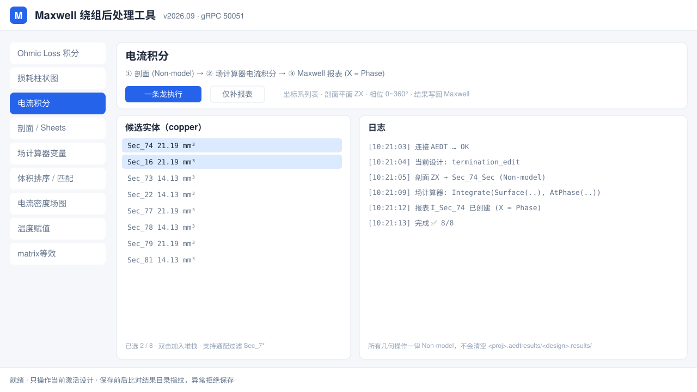

# Maxwell Winding Post-Processor


> A desktop GUI that turns tedious Ansys Maxwell post-processing into one-click batch jobs —
> sectioning, current integration, Ohmic-loss sweeps, and lumped-parameter (RL matrix / T-equivalent)
> extraction — **without** destroying your solved results.

面向 **Ansys Maxwell / AEDT** 的 PCB 绕组 / 变压器仿真后处理工具。把原本要在 AEDT 里反复手点的操作
（剖切面、场计算器电流积分、OhmicLoss 扫描、矩阵提取与集总等效）做成批量一键操作，
并且**全程保护已求解的结果文件**。

---

## 📸 界面



> 首图为矢量界面示意（`docs/screenshot.svg`）。想换成真机截图：直接在 GitHub 仓库页面
> 把 PNG 拖进 `docs/` 目录即可（网页端上传不受本地加密影响），然后把上面的文件名改成
> `docs/screenshot.png`。

九个功能页：

| Tab | 作用 |
|---|---|
| **Ohmic Loss 积分** | 批量对选中 copper 实体做欧姆损耗积分，写回设计变量/命名表达式 |
| **损耗柱状图** | 把损耗结果直接画成柱状图（真机验证过：Σ 与 Maxwell 报告一致） |
| **电流积分** | ⚡ 剖面 → 场计算器电流积分 → Maxwell 内建 Rectangular Plot（X = Phase）一条龙 |
| **剖面 / Sheets** | 批量创建 **Non-model** 剖切片体（见下方安全须知） |
| **场计算器变量** | 批量创建/管理场计算器命名表达式 |
| **体积排序 / 匹配** | 按体积排序实体、跨设计匹配同名/同体积对象 |
| **电流密度场图** | 批量导出 J 场图 |
| **温度赋值** | 按材料/实体批量赋温度，用于温升耦合 |
| **matrix等效** | 离线读取 `.aedtresults`，解析 RL 矩阵 → 端口串并联 → T 型等效 / 三端口 LLC 均流 |

---

## ✨ 几个值得一提的点

### 1. 不会毁掉你的仿真结果
AEDT 一旦发现「模型变了」就会判定解失效，并把 `<工程>.aedtresults/<设计>.results/` **物理删除**（不进回收站）。
PyAEDT 的高层 API（`modeler.section()` / `separate_bodies()`）内部硬编码了 `NewPartsModelFlag:="Model"`，
一旦调用，几个小时的求解就没了。

本项目所有剖切操作都走底层命令并**显式传 `"NonModel"`**，片体不参与网格，因此不触发失效；
保存前后还会比对结果目录指纹，异常直接拒绝保存。

### 2. matrix等效：不连 AEDT 也能算
不需要导出报表。直接解析结果目录里的纯文本：

```
<工程>.aedtresults/<设计>.results/DV*_SOL*_PAR<MatrixID>_V*.sd
```

数据行长这样：

```
6.500000e+05 M([1 1]5.408e-08)MR([1 1]7.52e-02)MI([1 1]2.21e-01)NSI(6.5e5)
```

- `M([i j]v)` → 电感矩阵（H）
- `MR([i j]v)` → 阻抗实部 = 交流电阻（Ω）
- `MI([i j]v)` → 阻抗虚部 = ωL（Ω）

自洽校验：`MI / (2π·650 kHz) = 5.40802e-08 H`，与 `M` 偏差 0.000%。

拿到矩阵后可以：定义端口（段间串/并联 + 段内并联支路 + 逐层反接）、做逆电感消去、
算 T 型等效（k, n, Lkp, Lks, Lm，副边漏感折算到原边）、扫 k12 看副边并联均流。
**改电阻/电感单位，结果实时跟着变**（内部始终存 SI 值，显示层换算）。

### 3. 界面所有内容框都能拖
结果框、堆栈框、候选实体框……凡是内容可能变多的，都做成了可拖动分隔条（`tk.PanedWindow`），
不是"跟着主窗口缩放"那种假拉伸。

---

## 🛠 环境要求

| 组件 | 说明 |
|---|---|
| 操作系统 | Windows（AEDT 只在 Windows 上跑） |
| Python | 3.9+，**需带 tkinter** |
| Ansys AEDT | 2021 R2 及以上（本项目在 2023 R1 / 2026 R1 上验证过） |
| PyAEDT | 0.7+（只后端子进程需要；GUI 主进程不依赖） |
| numpy | 仅 matrix等效 tab 需要 |

---

## 🚀 快速开始

```bash
# 1. 拿到代码
git clone https://github.com/LeeLeeLeez/maxwell-post-gui.git
cd maxwell-post-gui

# 2. 装依赖（GUI 本体零依赖，tkinter 随 Python 附带）
pip install numpy            # matrix等效 tab 需要
pip install pyaedt           # 后端子进程需要

# 3. 启动
python aedt_gui.py
# 或者静默启动（无控制台黑窗）
pythonw aedt_gui.py
# Windows 也可以直接双击 run_aedt_gui.bat
```

1. 打开 AEDT，把目标工程设计设为当前激活设计（GUI 只操作当前激活设计，不会帮你切工程）。
2. 在 GUI 里点「扫描当前设计」，选中要处理的 copper 实体。
3. 切到对应 Tab 执行操作。

> 后端子进程通过 gRPC 与 AEDT 通信，默认端口 `50051`。
> 若改了端口，改 `aedt_gui.py` 里的 `GRPC_PORT`。

---

## 📁 目录结构

```
.
├── aedt_gui.py                  # GUI 主程序（Tkinter，零 PyAEDT 依赖）
├── aedt_gui_backend.py          # 后端：扫描 / OhmicLoss（PyAEDT，子进程调用）
├── current_integral_pipeline.py # 后端：剖面 + 电流积分 + 报表一条龙
├── aedt_env.py                  # PyAEDT 环境封装（gRPC 连接、打开设计的守卫）
├── section_cs.py                # 坐标系 / 剖切面工具
├── indcalc_core.py              # 纯 numpy 集总计算：矩阵解析、端口化简、T 型等效
├── maxwell_m.ico                # 图标
├── run_aedt_gui.bat             # 静默启动
├── run_aedt_gui_debug.bat       # 带控制台启动（看 traceback 用）
└── docs/                        # 文档配图
```

`indcalc_core.py` 是纯计算模块，**不依赖 AEDT**，可以单独 import 用在自己的脚本里：

```python
import indcalc_core as ic
names, R, L = ic.parse_matrix_rl(text, r_unit="ohm", l_unit="uH")
Lp = ic.compute_port_matrix(L, layer_names, ports, keep_unused_open=True)
te = ic.compute_t_equiv(Lp, port_names, prim="P", sec="S")
print(te["k"], te["n"], te["Lkp"], te["Lks"], te["Lm"])
```

---

## ⚠️ 安全须知（务必先读）

1. **动几何前先备份。** AEDT 的 gRPC 接口没有可用的撤销栈 —— `oEditor.Undo` 不存在，
   `oProject.Undo()` 调用成功但状态零变化，GUI 里 Ctrl+Z 对脚本操作同样无效。
2. **`.aedt` 备份不含结果。** 结果在 `<工程>.aedtresults/<设计>.results/`，
   要保住结果必须单独拷整个 `.aedtresults` 目录。
3. **剖切一律 Non-model。** 本工具已强制，但若你手写脚本，别用
   `modeler.section()` / `separate_bodies()` 的默认参数。
4. 工具只操作**你当前激活的设计**，执行前请确认 AEDT 里的激活设计是对的。

---

## ❓ 常见问题

**Q：GUI 能连上但扫描不到实体？**
A：确认 AEDT 已打开工程并且目标设计是激活设计；确认 gRPC 端口一致（默认 50051）。

**Q：提示「未找到 indcalc_core / numpy」？**
A：把 `indcalc_core.py` 放在 GUI 同目录，或设置环境变量 `MAXWELL_MATRIX_CORE_DIR`
指向它所在目录；并安装 numpy。

**Q：matrix 结果读出来是 1×1？**
A：说明该设计的 Matrix 参数里只配了一个 Winding。到 Maxwell 的
`Excitations → Matrix` 里把需要的 Winding 都加进同一个 Matrix。

**Q：支持 Maxwell 2D 吗？**
A：当前面向 3D（AC Magnetic / Transient）。2D 的剖切与积分逻辑不同，暂未适配。

**Q：我的机器装了 DLP 透明加密，能直接用 git 提交吗？**
A：不能。非白名单进程（git.exe、PowerShell）读到的源文件是密文
（文件头 `%TSD-Header-###%`，大小被填充成 1024 的整数倍），git 会把它当二进制 blob
提交，仓库里就是一堆解不开的乱码 —— 而且被 git 判为 binary 后连 diff 都做不了。

   判断方法：`git add` 后 `git diff --cached --stat`，若显示 `Bin 0 -> 12288 bytes`
   而不是行数，说明踩中了这个坑。

   绕法：Python 在白名单里、读到的是明文，所以本仓库提供上传器
   直接调 GitHub REST API 建 commit，完全不用 git.exe。
   双击 `upload_gui.py`（或桌面快捷方式）会弹出图形界面，填 Token 即可；命令行则是：

```bash
set GITHUB_TOKEN=ghp_xxx
python gh_upload.py --repo maxwell-post-gui --public      # 首次，自动建库
python gh_upload.py --repo maxwell-post-gui -m "修某个 bug"  # 之后每次更新
```

   补充：PNG 更麻烦——驱动会**异步**加密，Python 刚写完读回是明文，几分钟后再读就成了
   密文，防不胜防。所以首图用 **SVG**（纯文本，不触发加密）；真机截图建议在
   GitHub 网页端直接上传，别走本地。

---

## 🤝 贡献

欢迎 Issue 和 PR。提交前请注意：

- 不要提交 `.aedt` / `.aedtresults` 等工程与结果文件（已在 `.gitignore` 中排除）
- 不要在公司/私有绝对路径上硬编码，用环境变量或相对路径
- 涉及几何修改的改动，请说明是否保持 Non-model

---

## 📄 License

[MIT](LICENSE) © 2026 joey

> 本项目是社区自发工具，与 Ansys 公司无隶属关系。
> Ansys、Maxwell、AEDT、Electronics Desktop 均为 Ansys, Inc. 的商标。
